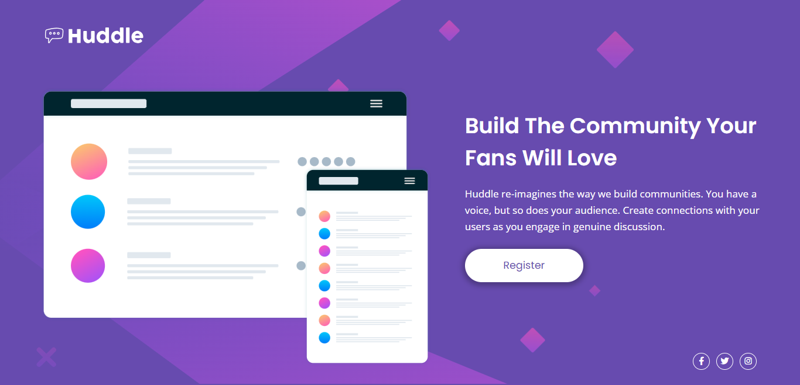
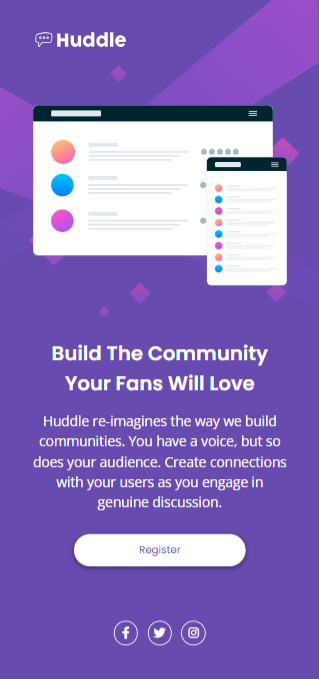
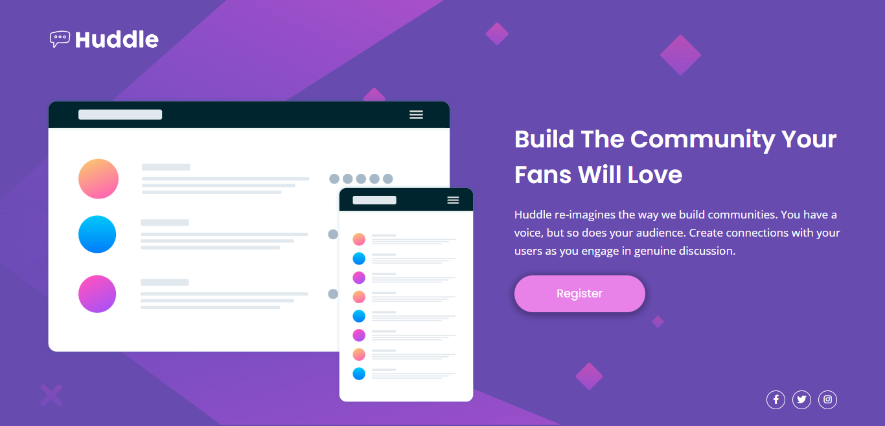

# Frontend Mentor - Huddle landing page with single introductory section solution

This is a solution to the [Huddle landing page with single introductory section challenge on Frontend Mentor](https://www.frontendmentor.io/challenges/huddle-landing-page-with-a-single-introductory-section-B_2Wvxgi0). Frontend Mentor challenges help you improve your coding skills by building realistic projects. 

## Table of contents

- [Overview](#overview)
  - [The challenge](#the-challenge)
  - [Screenshot](#screenshot)
  - [Links](#links)
- [My process](#my-process)
  - [Built with](#built-with)
  - [What I learned](#what-i-learned)
  - [Useful resources](#useful-resources)
- [Author](#author)

**Note: Delete this note and update the table of contents based on what sections you keep.**

## Overview

### The challenge

Users should be able to:

- View the optimal layout for the page depending on their device's screen size
- See hover states for all interactive elements on the page

### Screenshot

### Links

- Solution URL: [https://github.com/floatingPebble/floatingPebble.huddle-landing-page-with-a-single-introductory-section-FM.io]

## My process

- HTML Layout
- Local CSS variables
- General CSS
- Mobile CSS
- Desktop CSS

### Built with

- Semantic HTML5 markup
- CSS custom properties
- CSS Flex
- Mobile-first workflow

### What I learned

Improved my knowledge on responsive designs, mobile first aproach, and dealing with SVG.

## Author

- Website - [floatingPebble](https://github.com/floatingPebble)
- Frontend Mentor - [@floatingPebble](https://www.frontendmentor.io/profile/floatingPebble)
- Twitter - [@ShyToadGames](https://twitter.com/ShyToadGames)
